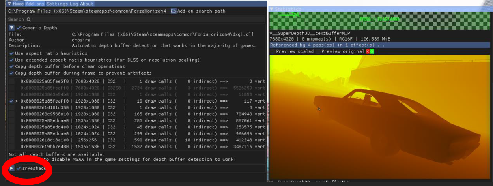

# Game Bridge Installation Guide

# Introduction

This guide shows how to quickly prepare a game in 3D using Game Bridge.

## Steps to set up ReShade:

1. Download all files from the [links below](#backup-links-for-files-\(google-drive\):)  
2. Install the SR Platform if you do not have the newest version already:   
   1. Step 1 \> SR-{version code}-win64.exe  
3. Install the SR SDK if you do not have the newest version already:  
   1. Step 1 \> simulatedreality-{version code}-win{platform}-Release.exe  
4. Find a game that runs in DirectX9/10/11 or DirectX12.   
5. Find the desired game's executable.   
   1. (In steam, you can right click a game in your library and click “properties \> local files \> browse”) 

   *(Note that some games have multiple executables and only one of them is the correct one. For UE4/5 games there's usually a win64-shipping.exe file hidden in a subfolder of the game files. Usually in “End \> Binaries \> Win64”)* 

6. Use the ReShade with addon support installer you downloaded in step 1\.  
   1. Select DirectX9 or DirectX10/11/12 when prompted depending on the game’s graphics API and click “next”.  
   2. Select any effects you would like to install and click “next”.  
      1. Optional: If your desired 3D method is 2D+Depth, you can download the “SuperDepth3D” shader from the list of available effects.  
   3. Select the “Game Bridge by Janthony & DinnerBram” addon when asked what addons you want to install.  
7. ***OPTIONAL***: If you are using Geo-11, make sure to set the output mode to SBS. “direct\_mode \= sbs” in d3dxdm.ini  
8. Start the game, ReShade should now successfully load the "srReshade" addon.  
9. You can check if the addon is loaded in the “Add-ons” tab in the ReShade overlay. Pressing the “home” key on your keyboard will open the ReShade overlay. 

   If you do not see "srReshade" show up in this tab, something went wrong. Please check ReShade’s log for any errors and refer to the limitations section of this document for possible other causes of incompatibility.   
10. If the addon still doesn’t work, expand (>) the “srReshade” section in the addon and check if an error message is displayed.

# Limitations and incompatibility 

This early version of the addon is purely meant as a proof of concept to help the community enable more games and applications for 3D using SR screens. 

This version is **lacking** some of our planned quality of life features. Furthermore, increased performance, stability and compatibility is being actively worked on. Contributions to the codebase are appreciated.

## Known limitations and issues: 

1. **The addon will ONLY work for DirectX9/10/11 or DirectX12 titles.** It will **NOT** work for any OpenGL/Vulkan applications at this moment.   
2. The addon can cause colours to show incorrectly while the 3D is active. This should immediately be obvious when the scene looks either far to bright or dim or has a weird rainbow coloured look. When this happens, please screenshot the addon tab of ReShade with the “srReshade” section expanded and make a bug report on the GitHub or message one of the devs directly.  
3. The application relies on ReShade being able to inject into the application’s rendering pipeline. As such, **applications that are not compatible with ReShade are also not compatible with this software now**. However, in some cases it is possible to inject ReShade on runtime into an application to enable it in titles from the Microsoft store (UWP apps) for instance. Crosire has an example script for how to do this on his GitHub.   
4. *“The 3D mode of my screen doesn’t turn off when I alt-tab out of the 3D application”*

   Yes, we know. This behaviour will be resolved later, for now just close the application if you want the SR screen to return to 2D mode.  
5. *“The addon is loaded in ReShade and the game is SBS, but it doesn’t turn 3D on\!”*

   Make sure your SR device is fully connected. That means that the computer must have a USB connection and a display connection to the screen.   
6. This version of the addon is only tested for ReShade version 6.2.0. API changes on ReShade’s side may make our addon incompatible with newer versions. This version of the addon has only been tested with SR Platform version 1.30.x- 1.31.1. It is possible that future versions of the platform will be incompatible with this addon.   
     
   If you run into any dependency related problems, you can consider messaging @dinnerbram or @janthony102 on Discord. We can see if we can help resolve your problem, but we are making no promises and we are under no obligation to do so. We hope you understand as we are spreading ourselves quite thin already. 

# Shortcuts 

This application currently has one QoL feature implemented which are the shortcuts. There are only four implemented shortcuts at the moment: 

* Toggle SR | **Hotkey: Ctrl+2**  
  * Toggles the lens of the screen off. This disables weaving and returns the application to its normal non-SR state.   
* Toggle SuperDepth3D | **Hotkey: Ctrl+3**  
  * If you have SuperDepth3D installed, this hotkey will toggle the state of the shader between on and off.  
* Toggle SR & SuperDepth3D | **Hotkey: Ctrl+4**   
  * Toggles both SR and the SuperDepth3D shader. Due to a small mess-up, this first toggles both effects OFF instead of ON meaning you may need to press the hotkey twice.  
* Toggle SR weaver latency mode | **Hotkey: Ctrl+5**  
  * You can see the current latency mode in the addon tab by opening the srReshade dropdown section. By default this latency is 40000 microseconds, this feature is experimental but should decrease crosstalk significantly at higher frame rates as long as the monitor and computer can keep up with it (120FPS and higher).

    Stick to the default setting if you’re not sure.

These shortcuts were mostly implemented for debugging, they might not be useful to everyone but I’ve included them here to avoid confusion. Later, these hotkeys are planned to be customizable, but they are static for this release.

## 

## Backup links for files (Google Drive):

**The SR Runtime software typically comes pre-installed with SR devices or can be downloaded from the vendor's support page. For updates or customer support, please visit the vendor's support page on their website.**

Latest tested ReShade version:  
[ReShade\_Setup\_6.2.0\_Addon.exe](https://drive.google.com/file/d/1W7AxPvQFzL6yLakXJKg2Qdgen3HU0eAc/view?usp=sharing)  
Latest tested GameBridge addon version (srReshade.addon):  
[srReshade v1.0.0.addon32 (32-bit)](https://drive.google.com/file/d/1VD4DeslGnVZr7pbiXOTLvZ5La6bFXrK6/view?usp=sharing)  
[srReshade v1.0.0.addon64](https://drive.google.com/file/d/1kYsAsX9MU-pPCY3wj8zkqeRk0r_1TKIB/view?usp=sharing)  
